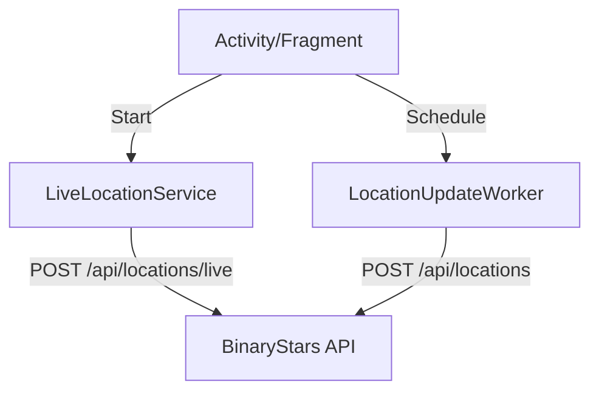

# BinaryStars.Android

BinaryStars Android is a native client built with **Kotlin** and **Jetpack**. It provides full access to device management, messaging, and real-time location sharing.

## Feature Coverage

- **Devices**: Link/unlink, telemetry sync, and availability toggles.
- **Messaging**: Real-time chat via WebSockets with REST fallback. Supports offline queuing.
- **File Transfers**: 
  - **API Path**: Streaming uploads/downloads via Kafka.
  - **Bluetooth Path**: Direct P2P transfers using RFCOMM (Android-to-Android or Android-to-Linux).
- **Notes**: Full CRUD support for plaintext and Markdown notes.
- **Map**: Live location tracking of self and other linked devices.
- **Notifications**: Receive, schedule, and sync with the backend.
- **Remote Actions**: Trigger actions (Lock, Shutdown, App Launch) on linked Linux targets.

## Background Architecture

The app uses several background components to ensure data stays in sync even when the UI is closed:

- **LiveLocationService**: A Foreground Service that posts the device's coordinates to the `/api/locations/live` endpoint every 15 seconds.
- **LocationUpdateWorker**: A periodic WorkManager job that persists historical location points.
- **DeviceSyncForegroundService**: Handles long-running data synchronization and ensures the device stays "Online" in the system.



## Bluetooth P2P Support

The Android app implements two RFCOMM-based services for peer-to-peer communication:

1.  **Chat Service** (UUID: `a64f3f3b-5ad0-4b65-9b8f-585a45c7e9c4`):
    - Uses JSON framing over Channel 1.
    - Compatible with `BinaryStars.Linux`.
2.  **Transfer Service** (UUID: `2b3d7e64-6d7b-4ad4-9d92-4b4c4b8d0d4c`):
    - Handles large file byte streams with resume/restart support on Channel 2.

## Prerequisites & Setup

### Permissions (Android 14+)
The app requires the following permissions for full functionality:
- `POST_NOTIFICATIONS`
- `BLUETOOTH_CONNECT` & `BLUETOOTH_SCAN`
- `ACCESS_BACKGROUND_LOCATION` (Must be granted manually in settings)
- `FOREGROUND_SERVICE_LOCATION` & `FOREGROUND_SERVICE_DATA_SYNC`

### External Auth
- **Google Auth**: Uses `credentials` and `googleid` libraries. Client ID is configured in `build.gradle.kts`.
- **Microsoft Auth**: Configured via `msal_config.json` in assets and `AndroidManifest.xml` (msauth scheme).

## Local Development

1.  Open the `BinaryStars.Android` folder in Android Studio.
2.  Configure your API host in `local.properties` or via Gradle:
    ```bash
    ./gradlew installDeviceDebug -PapiHost=192.168.1.XX
    ```
3.  Ensure the `BinaryStars.Api` is reachable from your device/emulator network.
