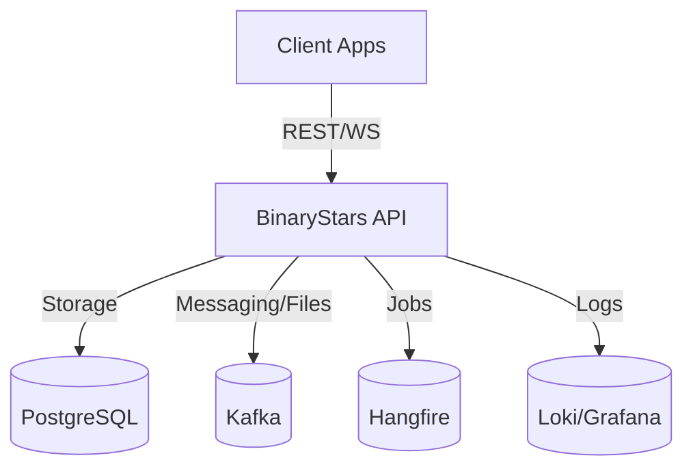
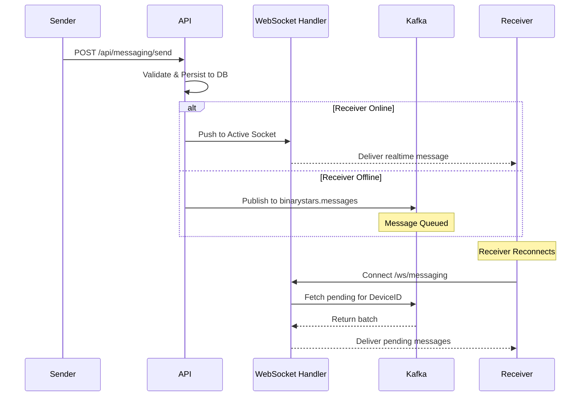

# BinaryStars API

The BinaryStars API is a **.NET 10.0** backend that powers authentication, device management, messaging, and file transfers.

## Core Features

- **Auth**: JWT-based authentication with support for Google and Microsoft external providers.
- **Messaging**: Real-time WebSocket relay with Kafka-backed persistence for offline devices.
- **File Transfers**: Chunked uploads to Kafka for high-throughput, async processing.
- **Background Jobs**: Powered by **Hangfire** for cleanup, scheduled notifications, and recurring tasks.
- **Observability**: Structured logging via **Serilog** with a **Grafana Loki** sink for centralized log management.
- **API Reference**: Built-in **Scalar** documentation available at `/scalar/v1` in development mode.

## Architecture & Data Flow



### Messaging & Notification Pipeline



## Configuration

The following sections in `appsettings.json` or environment variables are required:

- **`Jwt`**: `Issuer`, `Audience`, `SigningKey`.
- **`Kafka`**: `BootstrapServers`, `SaslUsername`, `SaslPassword`, `SecurityProtocol`.
- **`Hangfire`**: `ConnectionString` (PostgreSQL), `Schema`.
- **`FileTransfer`**: `TempFilePath`, `ChunkSize`, `RetentionDays`.
- **`Serilog`**: `LokiUrl` (Optional).

## Local Development

### Run with Docker (Recommended)
The easiest way to run the API with its dependencies (PostgreSQL, Kafka) is via the root `docker-compose.yaml`:
```bash
docker compose up -d binarystars-api
```

### Run Manually
Ensure PostgreSQL and Kafka are running, then:
```bash
dotnet run --project BinaryStars.Api
```
Access the API Reference at `http://localhost:5004/scalar/v1`.

## Deployment

- **ARM64 Support**: The API is compatible with ARM64 architectures, making it suitable for deployment on Raspberry Pi 4/5.
- **Scale**: The stateless REST controllers allow for horizontal scaling, while Kafka handles the state for distributed messaging.
