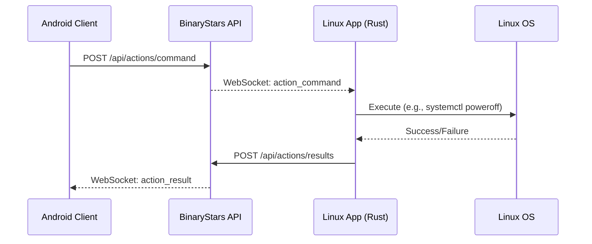

# BinaryStars.Linux (Tauri)

BinaryStars Linux is a desktop client built with **React**, **TypeScript**, and **Tauri v2**. It reproduces the Android app feature set with a responsive desktop/tablet UI and adds deep Linux system integration.

## Feature Coverage

- **Devices**: Link/unlink, online/offline status, and detailed telemetry (CPU, Memory, Battery).
- **File Transfers**: Send/list/download/reject. Supports clearing history by scope.
- **Notes**: Create/edit/delete with Markdown preview support.
- **Messaging**: Chat list and direct messaging with real-time WebSocket updates and REST fallback.
- **Notifications**: Send, schedule, and sync acknowledgement. Native desktop notifications via D-Bus.
- **Map**: Device location history and background location posting using **GeoClue2**.
- **Remote Actions**: (Targeting this Linux device)
  - Lock Screen (`loginctl`, `xdg-screensaver`)
  - Shutdown / Reboot (`systemctl`)
  - List/Launch Installed Apps (`.desktop` parsing + `gio`)
  - List/Close Running Apps (`sysinfo` + `wmctrl`)
- **Clipboard History**: Fetch and sync clipboard history (requires `copyq` or `cliphist`).
- **Settings**: Profile management, theme modes (Light/Dark/System), and background location toggles.

## System Dependencies

To enable all native features, ensure the following tools are installed on your Linux system:

```bash
# Ubuntu/Debian/Raspberry Pi OS
sudo apt install wmctrl copyq bluetooth-sendto network-manager geoclue-2.0 libdbus-1-dev
```

## Runtime Modes

- **Standard Mode**: Full access to UI, messaging, and most remote actions.
- **Sudo Mode (Elevated)**: Required for certain system-level actions if polkit rules are restrictive. Note: Native location (GeoClue) may be blocked in full-app sudo mode due to desktop session permissions.

## Bluetooth Support

The Linux app supports **client-side Bluetooth sending** to Android targets.

- **Sender Mode**: Can discover nearby devices and send files via `bluetooth-sendto`.
- **Receiver Mode**: Currently not supported in the Linux app runtime. Use Android as the primary P2P host.

### Configuration (BlueZ)

1.  Enable compatibility mode in `/lib/systemd/system/bluetooth.service`:
    ```bash
    ExecStart=/usr/lib/bluetooth/bluetoothd --compat
    ```
2.  Restart: `sudo systemctl daemon-reload && sudo systemctl restart bluetooth`
3.  Permissions: `sudo usermod -aG lp $USER`

## Remote Action Flow



## Local Development

### Prerequisites
- Node.js (v18+)
- Rust (latest stable)
- System dependencies (see above)

### Commands
```bash
# Install JS dependencies
npm install

# Run in development mode
npm run tauri dev

# Build release bundle
npm run tauri build
```

## Technical Notes

- **Logs**: Native and UI logs are stored in `/tmp/binarystarslinux/logs/binarystarslinux.log`.
- **Location**: Uses the `org.freedesktop.GeoClue2` D-Bus interface.
- **App Discovery**: Parses `.desktop` files from `/usr/share/applications` and `~/.local/share/applications`.
- **Clipboard**: Prioritizes `copyq`, falls back to `cliphist`, then `wl-paste`/`xclip` for the current item.
