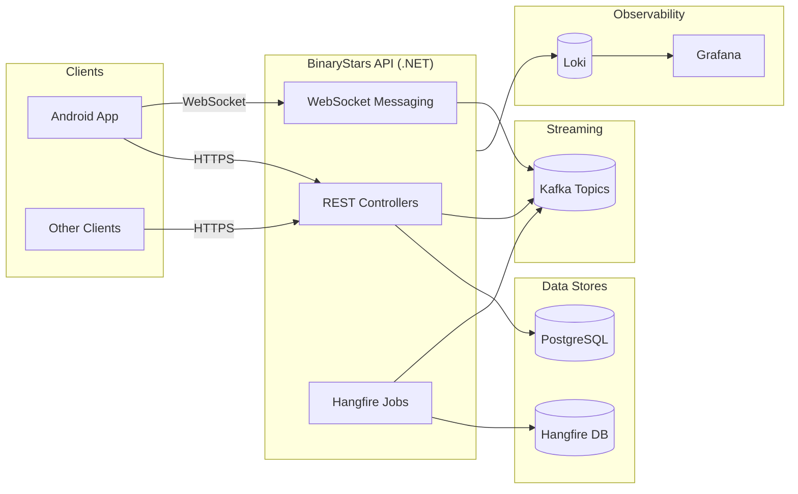
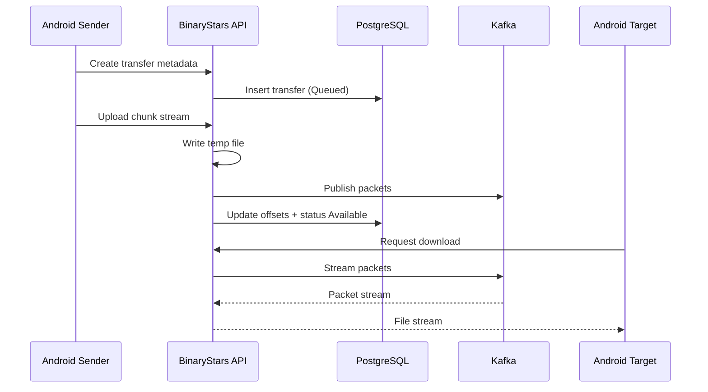

# BinaryStars

BinaryStars is a multi-client system (API + Android + Kafka) for device
management, notes, file transfers, messaging, and location history.

## Repository Layout

- API service: [BinaryStars.Api/README.md](BinaryStars.Api/README.md)
- Android app: [BinaryStars.Android/README.md](BinaryStars.Android/README.md)
- Kafka TLS/SASL setup: [kafka/README.md](kafka/README.md)
- Local infrastructure: [docker-compose.yaml](docker-compose.yaml)

## Architecture Overview

BinaryStars is centered on the API service, which handles auth, device
management, notes, messaging, and file transfer coordination. Kafka streams
file payloads and queued messages, while PostgreSQL stores durable state.
Hangfire runs background cleanup and transfer jobs.



## File Transfer Flow



## Secrets And Configuration

- Do not commit real secrets or private keys.
- API secrets live in appsettings files or environment variables.
- Kafka TLS keys and SCRAM credentials live under kafka/secrets.
- Android OAuth IDs and signing metadata are described in the Android README.

## Docker And Local Dev

Start the infrastructure stack (PostgreSQL, Kafka, Grafana/Loki):

```bash
docker compose up -d
```

For Kafka-only setup and TLS/SASL certificate generation, follow
[kafka/README.md](kafka/README.md).

## Cloud Deployment Notes

- Use managed PostgreSQL and Kafka in production.
- Store JWT signing keys, OAuth secrets, and TLS materials in a secret manager.
- Configure service settings with environment variables (do not rely on dev
  appsettings files).
- Update OAuth redirect URIs and signing fingerprints for release builds.
