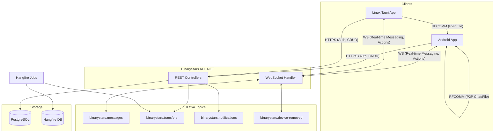
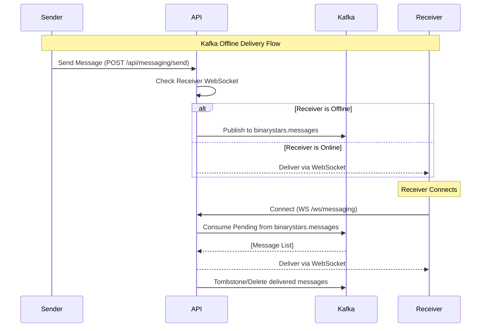
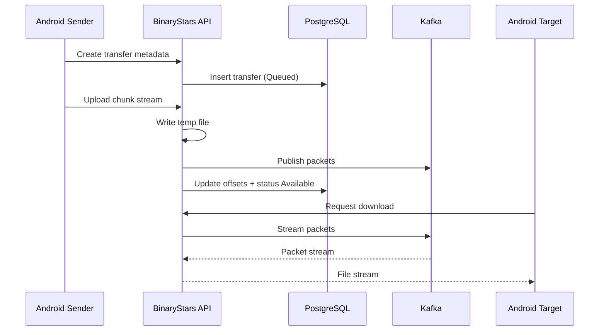
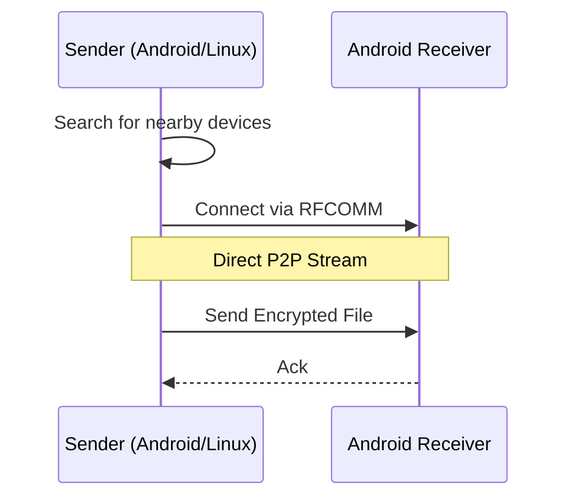

# BinaryStars

BinaryStars is a multi-client system (API + Android + Kafka) for device
management, notes, file transfers, messaging, and location history.

Current feature set also includes:

- Notification send/schedule/sync flows
- Remote Linux actions (screen lock, power, app open/close/list)
- Device presence and live location websocket events
- Clipboard history retrieval from online Linux targets

## Repository Layout

- API service: [BinaryStars.Api/README.md](BinaryStars.Api/README.md)
- Android app: [BinaryStars.Android/README.md](BinaryStars.Android/README.md)
- Kafka TLS/SASL setup: [kafka/README.md](kafka/README.md)
- Local infrastructure: [docker-compose.yaml](docker-compose.yaml)

## System Connectivity & Features

BinaryStars utilizes multiple communication protocols to balance reliability, real-time performance, and peer-to-peer flexibility.

### 1. Protocol Comparison & Feature Map

| Feature | REST API (HTTPS) | WebSocket (WS) | Kafka (Internal) | Bluetooth (P2P) |
| :--- | :---: | :---: | :---: | :---: |
| **Authentication & Profile** | Primary | - | - | - |
| **Device Registration** | Primary | - | - | - |
| **Notes & History** | Primary | - | - | - |
| **Real-time Messaging** | Fallback | **Primary** | Queue/Persistence | - |
| **Remote Actions** | Bridge | **Primary** | - | - |
| **Live Location Updates** | - | **Primary** | - | - |
| **File Transfers** | Metadata/Bridge | - | **Packet Stream** | **Android, Linux(S), Pi(S)** |
| **Notifications** | Scheduling/Sync | - | **Queue/Push** | - |

### 2. Communication Flow


```mermaid
flowchart TD
    subgraph Clients
        Android[Android App]
        Linux[Linux Tauri App]
    end

    subgraph API_Layer [BinaryStars API .NET]
        REST[REST Controllers]
        WS[WebSocket Handler]
    end

    subgraph Messaging_Backplane [Kafka Topics]
        KT_Msg[binarystars.messages]
        KT_Trans[binarystars.transfers]
        KT_Notif[binarystars.notifications]
        KT_Dev[binarystars.device-removed]
    end

    subgraph Storage
        DB[(PostgreSQL)]
        HF[(Hangfire DB)]
    end

    %% Communication paths
    Android -- "HTTPS (Auth, CRUD)" --> REST
    Linux -- "HTTPS (Auth, CRUD)" --> REST

    Android -- "WS (Real-time Messaging, Actions)" <--> WS
    Linux -- "WS (Real-time Messaging, Actions)" <--> WS

    Android -- "RFCOMM (P2P Chat/File)" <--> Android
    Linux -- "RFCOMM (P2P File)" --> Android

    %% Internal API logic

    REST --> DB
    REST --> KT_Trans
    WS <--> KT_Msg
    WS <--> KT_Dev
    REST --> KT_Notif
    
    %% Background Jobs
    Jobs[Hangfire Jobs] --> HF
    Jobs --> KT_Trans
```

### 3. Kafka Integration Details

Kafka serves as the high-throughput, durable backplane for the system, specifically handling:

- **File Streaming:** Files are split into packets and published to `binarystars.transfers`. This allows for large transfers without blocking API threads.
- **Message Queuing:** If a target device is offline, messages are queued in `binarystars.messages` and delivered immediately upon WebSocket reconnection.
- **Device Lifecycle:** `binarystars.device-removed` events ensure all active sessions are notified when a device is unlinked.
- **Notifications:** Queued in `binarystars.notifications` for reliable delivery to mobile clients.


```mermaid
sequenceDiagram
    participant S as Sender
    participant A as API
    participant K as Kafka
    participant R as Receiver

    Note over S,R: Kafka Offline Delivery Flow
    S->>A: Send Message (POST /api/messaging/send)
    A->>A: Check Receiver WebSocket
    alt Receiver is Offline
        A->>K: Publish to binarystars.messages
    else Receiver is Online
        A-->>R: Deliver via WebSocket
    end
    
    Note over R: Receiver Connects
    R->>A: Connect (WS /ws/messaging)
    A->>K: Consume Pending from binarystars.messages
    K-->>A: [Message List]
    A-->>R: Deliver via WebSocket
    A->>K: Tombstone/Delete delivered messages
```

## File Transfer Flow


```mermaid
sequenceDiagram
	participant Sender as Android Sender
	participant API as BinaryStars API
	participant DB as PostgreSQL
	participant Kafka as Kafka
	participant Target as Android Target

	Sender->>API: Create transfer metadata
	API->>DB: Insert transfer (Queued)
	Sender->>API: Upload chunk stream
	API->>API: Write temp file
	API->>Kafka: Publish packets
	API->>DB: Update offsets + status Available
	Target->>API: Request download
	API->>Kafka: Stream packets
	Kafka-->>API: Packet stream
	API-->>Target: File stream
```

## Bluetooth P2P Transfers & Chat

BinaryStars supports direct Bluetooth communication using RFCOMM.

- **Android**: Full P2P support. Acts as both Sender and Receiver (Server) for chat and files.
- **Linux / Raspberry Pi**: Client-only support. Can discover nearby devices and **send** files to Android targets using `bluetooth-sendto`.


```mermaid
sequenceDiagram
    participant S as Sender (Android/Linux)
    participant R as Android Receiver
    S->>S: Search for nearby devices
    S->>R: Connect via RFCOMM
    Note over S,R: Direct P2P Stream
    S->>R: Send Encrypted File
    R-->>S: Ack
```

### Linux Configuration (BlueZ)

To enable Bluetooth server functionality on Linux, your Bluetooth daemon must run in compatibility mode for SDP registration.

1.  Edit `/lib/systemd/system/bluetooth.service`:
    ```bash
    ExecStart=/usr/lib/bluetooth/bluetoothd --compat
    ```
2.  Restart service:
    ```bash
    sudo systemctl daemon-reload && sudo systemctl restart bluetooth
    ```
3.  Add your user to the `lp` group for RFCOMM socket access:
    ```bash
    sudo usermod -aG lp $USER
    ```

### Protocol Implementation

- **Chat Service:** RFCOMM Channel 1 (SPP). Handles JSON-framed messages.
- **Transfer Service:** RFCOMM Channel 2. Handles encrypted file byte streams with resume support.

## Secrets And Configuration

- Do not commit real secrets or private keys.
- API secrets live in appsettings files or environment variables.
- Kafka TLS keys and SCRAM credentials live under kafka/secrets.
- Android OAuth IDs and signing metadata are described in the Android README.

## Docker And Local Dev

Start the infrastructure stack (PostgreSQL, Kafka, Grafana/Loki):

```bash
docker compose up -d
```

Start/rebuild all services:

```bash
docker compose up -d --build
```

Start/rebuild only API container:

```bash
docker compose up -d --build binarystars-api
```

Check API logs:

```bash
docker compose logs -f binarystars-api
```

## Deploying to Raspberry Pi

You can run the full BinaryStars infrastructure on a Raspberry Pi to serve as a 24/7 home server for your devices on the same network.

### 1. Prerequisites

- Raspberry Pi 4 or 5 (4GB+ RAM recommended).
- Raspberry Pi OS Lite (64-bit) or any ARM64 Linux distribution.
- Docker and Docker Compose installed.

Install Docker on Raspberry Pi:
```bash
curl -sSL https://get.docker.com | sh
sudo usermod -aG docker $USER
# Log out and log back in for group changes to take effect
```

### 2. Setup

Clone the repository and generate the required Kafka certificates:

```bash
git clone https://github.com/tds/BinaryStars.git
cd BinaryStars
# Follow steps in kafka/README.md to generate certificates
```

### 3. Run

Start the full stack using Docker Compose:

```bash
docker compose up -d
```

### 4. Client Connection

Find your Pi's IP address:
```bash
hostname -I
```

- **Android:** Use the helper script with the Pi's IP:
  ```bash
  cd BinaryStars.Android
  ./scripts/install-device-debug.sh --host <PI_IP>
  ```
- **Linux:** Set the environment variable before running:
  ```bash
  VITE_API_BASE_URL=http://<PI_IP>:5004/api npm run tauri dev
  ```

## Full Integration Debug Commands

Use this flow when testing Linux + Android + API together.

### 1. Docker build and run

From repository root:

```bash
docker compose up -d --build
```

Check API/container health:

```bash
docker compose ps
docker compose logs -f binarystars-api
```

### 2. Build Linux release

From `BinaryStars.Linux`:

```bash
npm install
npm run tauri:build:local
```

### 3. Run Linux app (release)

From `BinaryStars.Linux`:

```bash
./scripts/run-release.sh
```

### 4. View Linux app logs (with and without filters)

Linux app log file:

- `/tmp/binarystarslinux/logs/binarystarslinux.log`

Live logs:

```bash
tail -f /tmp/binarystarslinux/logs/binarystarslinux.log
```

Filtered logs (errors + key sources):

```bash
rg "<LINUX_LOG_FILTER_REGEX>" /tmp/binarystarslinux/logs/binarystarslinux.log
```

Live filtered stream:

```bash
tail -f /tmp/binarystarslinux/logs/binarystarslinux.log | rg --line-buffered "<LINUX_LOG_FILTER_REGEX>"
```

Possible values for `<LINUX_LOG_FILTER_REGEX>`:

- `level=error`
- `level=warn`
- `source=ui:actions`
- `source=rust:actions`
- `source=ui:ws`
- `source=ui:ws.actions`
- Combined example: `level=error|source=ui:actions|source=rust:actions`

### 5. Install Android app on a connected physical device with reachable network config

Important: the helper script auto-detects your host IP and passes it to Gradle (`-PapiHost`), which is what makes the device reach your machine over hotspot/LAN.

From `BinaryStars.Android`:

```bash
./scripts/install-device-debug.sh
```

Optional explicit host/port:

```bash
./scripts/install-device-debug.sh --host <HOST_IP> --port 5004
```

Manual equivalent command:

```bash
./gradlew :app:installDeviceDebug -PapiHost=<HOST_IP> -PapiPort=5004
```

Quick host IP lookup (Linux):

```bash
ip route get 1.1.1.1
```

You can also verify device connection before install:

```bash
adb devices
```

### 6. View logs from connected Android device (with filters)

Full app logs from connected device:

```bash
adb logcat --pid "$(adb shell pidof -s com.tds.binarystars | tr -d '\r')"
```

Filtered logs (app tags + networking/errors):

```bash
adb logcat --pid "$(adb shell pidof -s com.tds.binarystars | tr -d '\r')" | rg --line-buffered -i "<ANDROID_LOG_FILTER_REGEX>"
```

Tag-only filter spec (quiet output):

```bash
adb logcat <ANDROID_LOGCAT_TAG_SPEC> *:S
```

Possible values for `<ANDROID_LOG_FILTER_REGEX>`:

- `BinaryStars`
- `BinaryStarsWS`
- `BinaryStarsActions`
- `BinaryStarsNotifications`
- `OkHttp`
- `WebSocket`
- `Retrofit`
- `Exception`
- `AndroidRuntime`
- Combined example: `BinaryStarsWS|BinaryStarsActions|Exception|AndroidRuntime`

Possible values for `<ANDROID_LOGCAT_TAG_SPEC>`:

- `BinaryStarsWS:D`
- `BinaryStarsActions:D`
- `BinaryStarsNotifications:D`
- `OkHttp:D`
- `MessagingSocketManager:D`
- Combined example: `BinaryStarsWS:D BinaryStarsActions:D BinaryStarsNotifications:D`

### Android Networking With Docker Compose

`docker-compose.yaml` publishes API on host port `5004` (`5004 -> 8080`), so Android clients should call the host machine IP on port `5004`.

- Emulator endpoint: `http://10.0.2.2:5004/api`
- Physical device endpoint: `http://<HOST_IP>:5004/api`
- WebSocket endpoint: `ws://<HOST_IP>:5004/ws/messaging`

Get host IP on Linux:

```bash
ip route get 1.1.1.1
```

Example output includes `src <HOST_IP>`.

Physical device install example:

```bash
cd BinaryStars.Android
./gradlew :app:installDeviceDebug -PapiHost=<HOST_IP> -PapiPort=5004
```

For Kafka-only setup and TLS/SASL certificate generation, follow
[kafka/README.md](kafka/README.md).

## Cloud Deployment Notes

- Use managed PostgreSQL and Kafka in production.
- Store JWT signing keys, OAuth secrets, and TLS materials in a secret manager.
- Configure service settings with environment variables (do not rely on dev
  appsettings files).
- Update OAuth redirect URIs and signing fingerprints for release builds.
