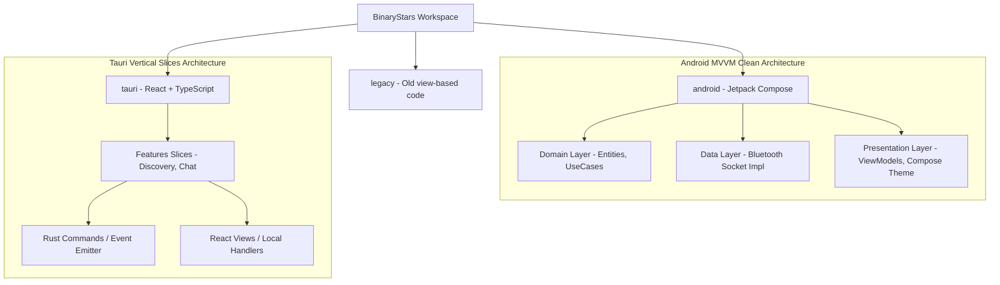

# BinaryStars 🌌

BinaryStars is a decentralized, peer-to-peer communication app that allows you to instantly chat and share files between your devices via **pure Bluetooth (RFCOMM/SPP)**. It requires no accounts, internet connectivity, or servers.

It supports seamless cross-platform connectivity:
- 📱 **Android to Linux**
- 💻 **Linux to Android**
- 📱 **Android to Android**
- 💻 **Linux to Linux**

---

## 🏗️ System Architecture

The codebase is split into two primary projects:


```mermaid
graph TD
    A[BinaryStars Workspace] --> B[android - Jetpack Compose]
    A --> C[tauri - React + TypeScript]
    A --> D[legacy - Old view-based code]
    
    subgraph Android MVVM Clean Architecture
        B --> B1[Domain Layer - Entities, UseCases]
        B --> B2[Data Layer - Bluetooth Socket Impl]
        B --> B3[Presentation Layer - ViewModels, Compose Theme]
    end
    
    subgraph Tauri Vertical Slices Architecture
        C --> C1[Features Slices - Discovery, Chat]
        C1 --> C2[Rust Commands / Event Emitter]
        C1 --> C3[React Views / Local Handlers]
    end
```

### 1. Android Application (`/android`)
Follows **MVVM Clean Architecture**:
- **Domain Layer**: Contains the core business rules and interfaces (`BtDevice`, `ChatMessage`, `BluetoothRepository` interface) and isolated **Use Cases** (`StartServerUseCase`, `ConnectToDeviceUseCase`, `SendMessageUseCase`, `SendFileUseCase`). No Android framework dependencies.
- **Data Layer**: Handles Bluetooth sockets, discovery receiver scanning, base64 formatting, and disk I/O (`BluetoothRepositoryImpl`).
- **Presentation Layer**: Built entirely on **Jetpack Compose** following an MVVM design. Displays a cosmic dark/frost light dashboard and chat logs.

### 2. Desktop Application (`/tauri`)
Follows a **Vertical Slices Architecture**:
- Instead of grouping files by technical layer (e.g., controllers, services, UI components), they are grouped by vertical feature slices:
  - **Discovery Slice**: Handles Bluetooth status check, device scanning, server hosting, and remote connection triggers (`DiscoveryPanel.tsx`, `discoveryApi.ts` and Rust module `discovery.rs`).
  - **Chat Slice**: Handles text transmission, file encoding, and downloading (`ChatPanel.tsx`, `chatApi.ts` and Rust module `chat.rs`).
- Shared state is safely managed in Rust utilizing a global `AppState` with Tokio mutexes, and events are emitted to the frontend.

---

## 📡 Bluetooth Communication Protocol

Communication is carried out using **Bluetooth SPP (Serial Port Profile)** on RFCOMM channel 1 using UUID `00001101-0000-1000-8000-00805F9B34FB`.

### 🤝 1. Connection Handshake
Upon socket connection (client to server), the following handshake must complete:
1. The **Client** transmits an identification header (optionally containing the password):
   ```text
   IDENTIFY|<client_device_id>|<optional_password>\n
   ```
2. The **Server** checks the connection status. If a client is already connected, it rejects the socket with `ERROR|Host busy: client already connected\n`. If a password was set by the host, it verifies the client password, rejecting with `ERROR|Password required or incorrect\n` on failure.
3. If valid, the **Server** responds with its own identification:
   ```text
   IDENTIFIED|<server_device_id>\n
   ```
4. Once both devices verify the protocol prefix, the state shifts to `Connected` and the UI updates.

### 💬 2. Message Formats
All frames are sent line-by-line (ending with `\n`).

* **Text Messages**:
  * Unencrypted: Simple raw text lines (newlines are replaced with spaces):
    ```text
    Hello space explorer!\n
    ```
  * Encrypted (AES-256-GCM): Pre-tagged with `ENC|` followed by the base64-encoded encrypted payload:
    ```text
    ENC|<encrypted_base64>\n
    ```
* **File Messages**:
  * Unencrypted: Transmitted as a piped payload containing the file name and base64-encoded binary:
    ```text
    FILE|<filename>|<base64_data>\n
    ```
  * Encrypted (AES-256-GCM): Pre-tagged with `ENC_FILE|` containing the filename and encrypted base64 payload:
    ```text
    ENC_FILE|<filename>|<encrypted_base64>\n
    ```
  * On Android, received files are decoded and stored in the app's internal sandbox: `filesDir/transfers/received`.
  * On Linux (Tauri), files are downloaded to the user's default system `Downloads` folder.

---

## 🎨 Design System

Both apps ditch classic material design templates in favor of a customized, high-contrast, premium interface:
* **Dark Theme (Deep Space)**: Translucent glassmorphic panels, neon borders, and glowing gradient accents (Cyan and Nebula Purple).
* **Light Theme (Frost Aurora)**: Translucent pearl white backgrounds, soft indigo outlines, and cool blue accents.
* Single-toggle switch in both app headers allows fluid theme switching.

---

## 🚀 Building & Running

### Android Project
1. Open the `/android` folder in Android Studio.
2. Build files are automatically configured with Jetpack Compose compiler plugins for Kotlin 2.0.21.
3. To compile from the CLI, run:
   ```bash
   cd android
   ./gradlew assembleDebug
   ```

### Tauri Project
1. Make sure you have Rust (`cargo`), Node.js (`npm`), and `libsoup` / `bluez` dependencies installed.
2. Build frontend and run the app:
   ```bash
   cd tauri
   npm install
   npm run tauri dev
   ```
