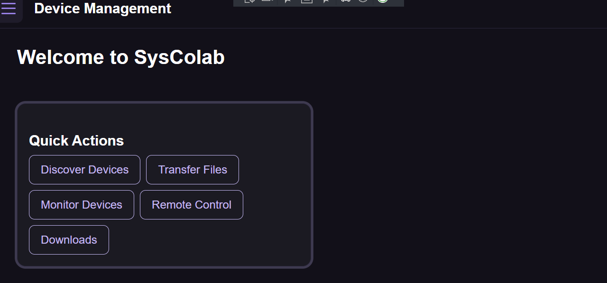
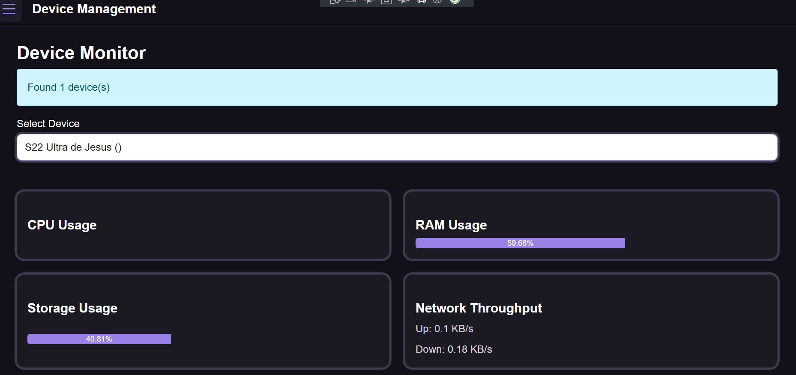
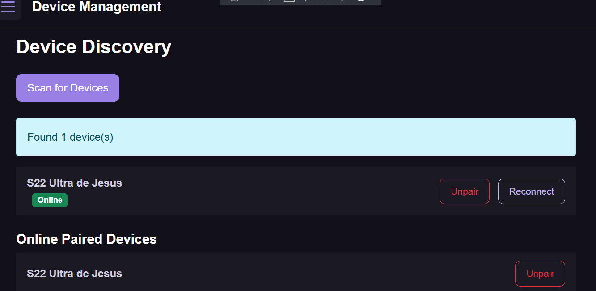
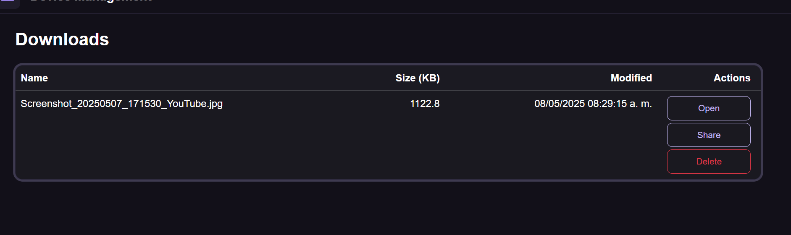
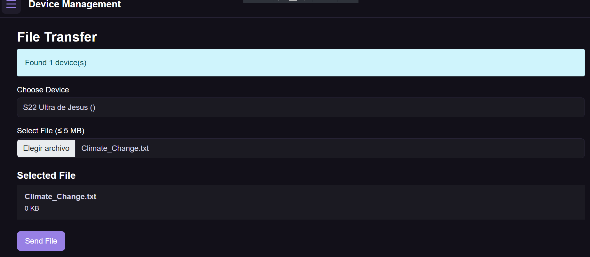
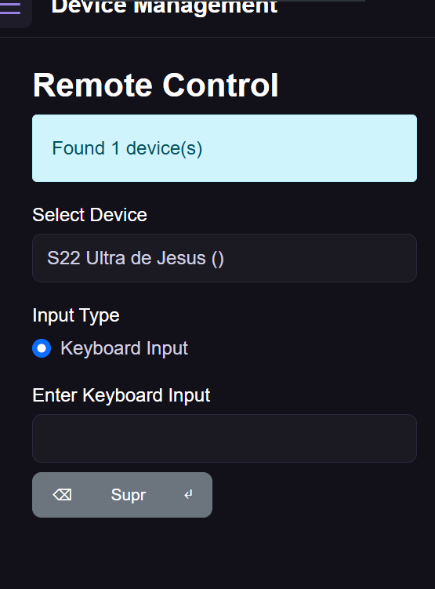

## 📄 Pages

SysColab provides a suite of collaborative and administrative tools, with each page serving a specific function:

### 🏠 Home

The landing page offers a dashboard view with a summary of connected devices and shortcuts to key actions.



---

### 🖥️ Monitor

Shows live status and metadata of all devices in the network. Useful for tracking availability and collaboration readiness.



---

### 🔍 Device Discovery

Scans the network to detect and list other SysColab-compatible devices, allowing quick addition for collaborative tasks.



---

### 📥 Downloads

Displays a history of received files, with options to open, clear, or organize them for future use.



---

### 🔁 File Transfer

A drag-and-drop interface for sharing files across devices. Shows real-time progress and status for each transfer.



---

### 🎮 Remote Control

Enables remote desktop control, and interactive sessions with connected devices.



---

## 🔄 SharedComponent.cs

`SharedComponent.cs` is a foundational component used across all pages in SysColab to maintain consistent, real-time connectivity between devices. It encapsulates shared logic required for registering devices, managing WebSocket connections, handling incoming messages, and orchestrating device interactions.

### Key Responsibilities

* **Device Registration**
  On initialization, the component gathers local device metadata (e.g., MAC address and name) and registers it with the backend API.

* **WebSocket Connection**
  Establishes a persistent connection with the SysColab WebSocket server using the device UUID, enabling real-time communication.

* **Global Message Handling**
  Listens for WebSocket messages (e.g., device pairing, metric requests, file offers, and remote input) and dispatches them to appropriate handlers based on the message type.

* **Device Discovery & Management**
  Periodically scans the network for other devices, updates their online/offline status, and filters them based on existing pairings.

* **Metric Sharing**
  Responds to metric requests by providing CPU, RAM, storage, and network stats for the local device, ensuring system monitoring is always up-to-date.

* **File Transfer**
  Handles incoming file offers, securely downloads the file via the backend, and saves it locally using cross-platform APIs.

* **Remote Input Simulation**
  On supported platforms, receives keystroke data and simulates keyboard input using the Windows Input Simulator.

### Why It Matters

Every page in SysColab inherits from or integrates with `SharedComponent`, ensuring a unified, always-connected experience. Whether you’re on the Monitor, File Transfer, or Remote Control page, this component guarantees your device is actively listening for collaboration events and ready to respond.

---

## 🧰 Helpers

The `Helpers` folder in SysColab contains utility classes that encapsulate reusable logic. One key class, `DeviceHelpers`, provides essential methods for identifying and naming the current device.

### `DeviceHelpers.cs`

This internal static helper class is used by core components like `SharedComponent` to obtain device-specific identifiers, ensuring each device is uniquely recognizable within the network.

#### Key Methods

* **`GetMacAddress()`**
  Retrieves the MAC address of the first active, non-loopback network interface. This MAC address is used as a unique identifier when registering with the SysColab backend.

* **`GetDeviceName()`**
  Returns the human-readable name of the device (via `DeviceInfo.Current.Name`). If the name can't be resolved, it defaults to `"Unknown"` and logs the exception.

These methods are vital for device registration, pairing, and identification throughout the SysColab ecosystem.

---

## 🧩 Services Architecture

SysColab is built using **.NET MAUI Blazor**, enabling rich UI and deep system integration across platforms like Windows and Android. The app relies on a modular **services architecture**, where functionality is divided into reusable and injectable components. Services are grouped into two main categories:

---

### 📦 Shared Services (`/Services`)

These services are written once and shared across all platforms. They encapsulate logic that is platform-agnostic and used across multiple pages or components.

#### 🔌 `ConnectivityService`

Manages the WebSocket connection to the SysColab server. It handles connection lifecycle, message sending, and receiving, and raises events (`MessageReceived`) for consumers like `SharedComponent`.

#### 🗺️ `DeviceMappingService`

Stores and retrieves device-to-GUID mappings using a local SQLite database. Ensures that each device has a consistent identity across sessions.

#### 🤝 `PairedDevicesService`

Manages peer-to-peer device relationships (pairing/unpairing). It uses SQLite to persist bidirectional device pairings and supports queries like “get all devices paired with X.”

#### 📁 `FileService`

Handles uploading and downloading files via the server. Uploads are size-guarded (e.g., 5 MB max) and sent via multipart HTTP; downloads are one-time fetches of blobs.

#### 🧮 `IDeviceMetricService` (Interface Only in `/Services`)

This interface abstracts platform-specific system metrics (CPU, RAM, etc.). The implementation is resolved at runtime based on the target platform (see below).

---

### 🖥️ Platform-Specific Services (`/Platforms/{PLATFORM}/Services`)

To retrieve real-time hardware statistics, SysColab implements the `IDeviceMetricService` differently per platform. These implementations interact with native APIs not available through .NET Standard.

#### 🪟 Windows — `Platforms/Windows/Services/DeviceMetricsService.cs`

Uses **Windows Performance Counters**, **WMI**, and **System.IO.DriveInfo** to calculate:

* CPU usage
* RAM usage
* Storage consumption
* Network upload/download speed

#### 🤖 Android — `Platforms/Android/Services/DeviceMetricsService.cs`

Uses **Android Java APIs** like `ActivityManager`, `TrafficStats`, and `StatFs` to get:

* CPU load from `/proc/stat`
* Memory info from the OS
* Storage stats
* Real-time network I/O

#### 🔧 Service Registration (via Conditional Compilation)

During app startup, the correct implementation is registered using preprocessor directives:

```csharp
#if ANDROID
    builder.Services.AddSingleton<IDeviceMetricService, SysColab.Platforms.Android.Services.DeviceMetricsService>();
#elif WINDOWS
    builder.Services.AddSingleton<IDeviceMetricService, SysColab.Platforms.Windows.Services.DeviceMetricsService>();
#endif
```

This ensures that all components needing metrics can use `IDeviceMetricService` without caring about the underlying platform.

---

### 🧠 Summary

| Service Name           | Scope              | Description                         |
| ---------------------- | ------------------ | ----------------------------------- |
| `ConnectivityService`  | Shared             | WebSocket communication             |
| `DeviceMappingService` | Shared             | Device-GUID mapping via SQLite      |
| `PairedDevicesService` | Shared             | Peer device relationship management |
| `FileService`          | Shared             | Upload/download via HTTP            |
| `IDeviceMetricService` | Shared (Interface) | System metrics abstraction          |
| `DeviceMetricsService` | Platform-Specific  | Windows or Android implementation   |

---

## 🧾 Models

SysColab uses a set of simple, structured models to represent messages, devices, and system state across the app. These models are primarily used for **data exchange**, **storage**, and **serialization** over WebSocket and HTTP communication.

### 📡 `ConnectResponse`

Represents the result of a connection attempt between two devices.

```csharp
public class ConnectResponse
{
    public bool Success { get; set; }
    public string DeviceId { get; set; }
    public string DeviceName { get; set; }
    public string ErrorMessage { get; set; }
}
```

---

### 🧭 `DeviceMapping`

Maps a device's MAC address to a globally unique identifier (GUID) used across the app.

```csharp
public class DeviceMapping
{
    [PrimaryKey]
    public string MacAddress { get; set; }
    public string Id { get; set; }
}
```

---

### 📊 `DeviceMetrics`

Contains real-time system performance data gathered from the device.

```csharp
public class DeviceMetrics
{
    public double CpuUsage { get; set; }
    public double RamUsage { get; set; }
    public double StorageUsage { get; set; }
    public double NetworkUp { get; set; }
    public double NetworkDown { get; set; }
}
```

---

### ❌ `ErrorResponse`

Used for reporting errors across WebSocket or HTTP messages.

```csharp
public class ErrorResponse
{
    public string ErrorCode { get; set; }
    public string Message { get; set; }
}
```

---

### 🔗 `PairedDevices`

Represents a bidirectional pairing between two devices, identified by their UUIDs.

```csharp
public class PairedDevices
{
    public string IdA { get; set; }
    public string IdB { get; set; }
}
```

---

### 🔓 `UnpairResponse`

Used to confirm the result of a device unpairing operation.

```csharp
public class UnpairResponse
{
    public bool Success { get; set; }
    public string DeviceId { get; set; }
    public string DeviceName { get; set; }
    public string ErrorMessage { get; set; }
}
```
