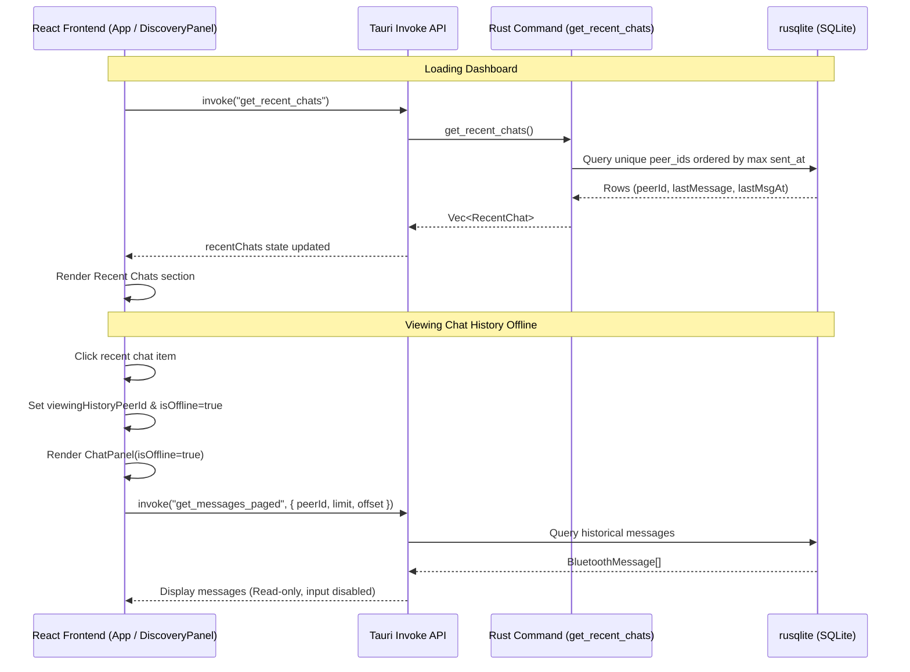
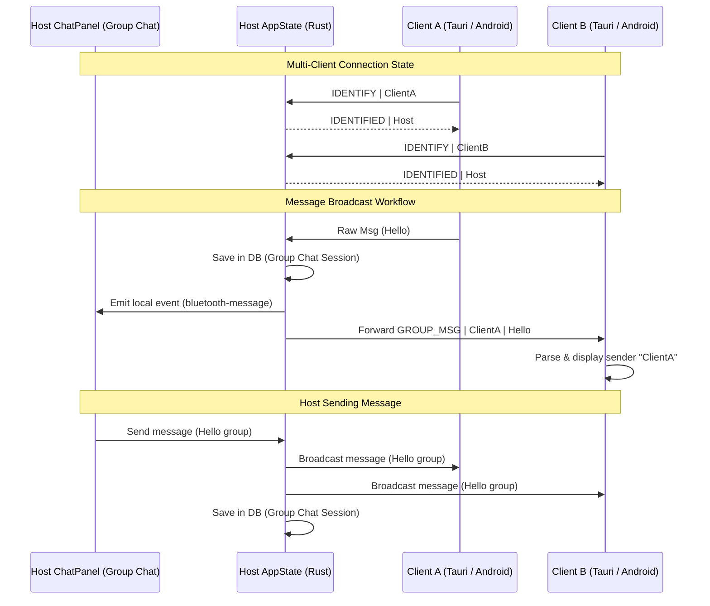

# Implementation Walkthrough: Recent Chats Feature

We have implemented the **Recent Chats** feature allowing you to view previous chats with other devices in offline/read-only mode. This enables you to access chat messages and downloads history without needing to actively connect to the device.

## Architecture Diagram

The following diagram illustrates how the frontend components and Rust command layers interact to fetch recent chats and support offline history viewing:



## Component Changes

### 1. Database & Rust Backend
* **[types.rs](file:///home/dontloseyourheadsu/Documents/GitHub/BinaryStars/tauri/src-tauri/src/core/types.rs)**: Added `RecentChat` struct supporting serialization to camelCase for the frontend.
* **[database.rs](file:///home/dontloseyourheadsu/Documents/GitHub/BinaryStars/tauri/src-tauri/src/core/database.rs)**: Implemented `query_recent_chats` which aggregates message records grouped by `peer_id` and sorted by the latest message's timestamp.
* **[chat.rs](file:///home/dontloseyourheadsu/Documents/GitHub/BinaryStars/tauri/src-tauri/src/features/chat.rs)**: Added the `get_recent_chats` Tauri command.
* **[lib.rs](file:///home/dontloseyourheadsu/Documents/GitHub/BinaryStars/tauri/src-tauri/src/lib.rs)**: Registered the command in the Tauri build handler.

### 2. Frontend Logic & API
* **[chatApi.ts](file:///home/dontloseyourheadsu/Documents/GitHub/BinaryStars/tauri/src/features/chat/chatApi.ts)**: Added `RecentChat` interface and `getRecentChats` invoke function.
* **[App.tsx](file:///home/dontloseyourheadsu/Documents/GitHub/BinaryStars/tauri/src/App.tsx)**: Added state for `recentChats` and `viewingHistoryPeerId`. Triggered a dashboard refresh whenever a user returns to the dashboard. Added routing condition:
  ```tsx
  } else if (viewingHistoryPeerId) {
    <ChatPanel
      isDark={isDark}
      peerId={viewingHistoryPeerId}
      isOffline={true}
      onDisconnect={() => setViewingHistoryPeerId(null)}
    />
  }
  ```

### 3. User Interface & Layout
* **[DiscoveryPanel.tsx](file:///home/dontloseyourheadsu/Documents/GitHub/BinaryStars/tauri/src/features/discovery/DiscoveryPanel.tsx)**: Added a "Recent Chats" section under "Receive Connections". Each item displays:
  * Chat icon `💬`
  * Peer Device ID
  * Relative timestamp of the last message
  * Preview of the last message (with auto-ellipses)
* **[ChatPanel.tsx](file:///home/dontloseyourheadsu/Documents/GitHub/BinaryStars/tauri/src/features/chat/ChatPanel.tsx)**: If `isOffline` is true:
  * Uses a grey indicator next to the peer title to signal offline status.
  * Sets the header label to `Historical Archive`.
  * Changes the disconnection button to `Close History`.
  * Hides the active transmission input tray and replaces it with a premium cosmic-styled status banner: *🪐 Viewing historical chat archive. Connect to device to transmit new signals.*
  * Keeps file download and save actions fully functional.
* **[features.css](file:///home/dontloseyourheadsu/Documents/GitHub/BinaryStars/tauri/src/features/features.css)**: Implemented styling rules for `.recent-item`, `.recent-info`, `.recent-meta`, `.offline-banner`, and `.online-indicator.offline` across both dark and light modes.

## Implementation: Multiple Device Sessions (Group Chat)

We have extended the application to support hosting a multiple-device group chat session. Several devices can connect to the host, which acts as a server and broadcasts all messages and files to all other connected devices.

### Architecture Workflow



### Modified Components

1. **Rust Backend & Tauri Command State**:
   * **[types.rs](file:///home/dontloseyourheadsu/Documents/GitHub/BinaryStars/tauri/src-tauri/src/core/types.rs)**: Added `ConnectedClient` and `clients: HashMap<String, ConnectedClient>` to `BluetoothState` to store all active client connection senders.
   * **[discovery.rs](file:///home/dontloseyourheadsu/Documents/GitHub/BinaryStars/tauri/src-tauri/src/features/discovery.rs)**: Cleared the `clients` map upon stopping the server.
   * **[bluetooth.rs](file:///home/dontloseyourheadsu/Documents/GitHub/BinaryStars/tauri/src-tauri/src/core/bluetooth.rs)**:
     * Allowed multiple clients to connect sequentially in the server loop without closing previous ones.
     * Implemented `broadcast_to_clients` to forward messages.
     * Decoded messages and forwarded them using `GROUP_MSG`, `GROUP_ENC`, `GROUP_FILE`, and `GROUP_ENC_FILE` protocols.
     * Supported parsing these headers on the client connection read loop to resolve actual sender names.
   * **[chat.rs](file:///home/dontloseyourheadsu/Documents/GitHub/BinaryStars/tauri/src-tauri/src/features/chat.rs)**: Updated `send_bluetooth_message` and `send_bluetooth_file` to broadcast to all connected clients if the host is hosting.

2. **Frontend UI (Tauri React)**:
   * **[App.tsx](file:///home/dontloseyourheadsu/Documents/GitHub/BinaryStars/tauri/src/App.tsx)**: Transitioned host to the `ChatPanel` with `peerId="Group Chat Session"` upon starting the server.
   * **[ChatPanel.tsx](file:///home/dontloseyourheadsu/Documents/GitHub/BinaryStars/tauri/src/features/chat/ChatPanel.tsx)**: Customized header titles ("Host Group Session", "Group Chat Room", "Stop Host") and rendered sender device IDs above incoming message bubbles.

3. **Android Client Support**:
   * **[BluetoothRepositoryImpl.kt](file:///home/dontloseyourheadsu/Documents/GitHub/BinaryStars/android/app/src/main/java/com/tds/binarystars/data/repository/BluetoothRepositoryImpl.kt)**: Added parsing for `GROUP_MSG` and `GROUP_FILE` prefixes to display actual senders.
   * **[MainScreen.kt](file:///home/dontloseyourheadsu/Documents/GitHub/BinaryStars/android/app/src/main/java/com/tds/binarystars/presentation/ui/MainScreen.kt)**: Displayed the sender device ID above the message bubble for group chat messages.


## Implementation: Commands Feature (e.g. Device Info)

We have implemented a **Commands** feature allowing devices to trigger special actions in the chat using the syntax `![[command]] {{--params}}`.

### Device Info Command (`!device-info`)
* **Trigger**: `!device-info`
* **Local Mode**: `!device-info --self`
* **Response**: A formatted text message detailing MAC, IP, WiFi/link speed, occupied storage, battery, occupied RAM, and occupied CPU.
* **Non-Linux Fallback**: Returns "not supported yet" for non-Linux devices.

### Modified Files:
* **[commands.rs](file:///home/dontloseyourheadsu/Documents/GitHub/BinaryStars/tauri/src-tauri/src/features/commands.rs)**: Handles retrieval of system statistics (MAC, IP, WiFi, storage, battery, RAM, CPU) on Linux.
* **[chat.rs](file:///home/dontloseyourheadsu/Documents/GitHub/BinaryStars/tauri/src-tauri/src/features/chat.rs)**:
  * Extracted `send_bluetooth_message_internal` helper.
  * Added `check_and_handle_incoming_command` to run incoming commands asynchronously.
  * Integrated local command execution for `!device-info --self` which bypasses Bluetooth connection transmission.
* **[bluetooth.rs](file:///home/dontloseyourheadsu/Documents/GitHub/BinaryStars/tauri/src-tauri/src/core/bluetooth.rs)**: Integrated `check_and_handle_incoming_command` triggers into client and server read loops.
* **[features.css](file:///home/dontloseyourheadsu/Documents/GitHub/BinaryStars/tauri/src/features/features.css)**: Styled `.message-text` with `white-space: pre-wrap;` to support multi-line formatted device info output.


