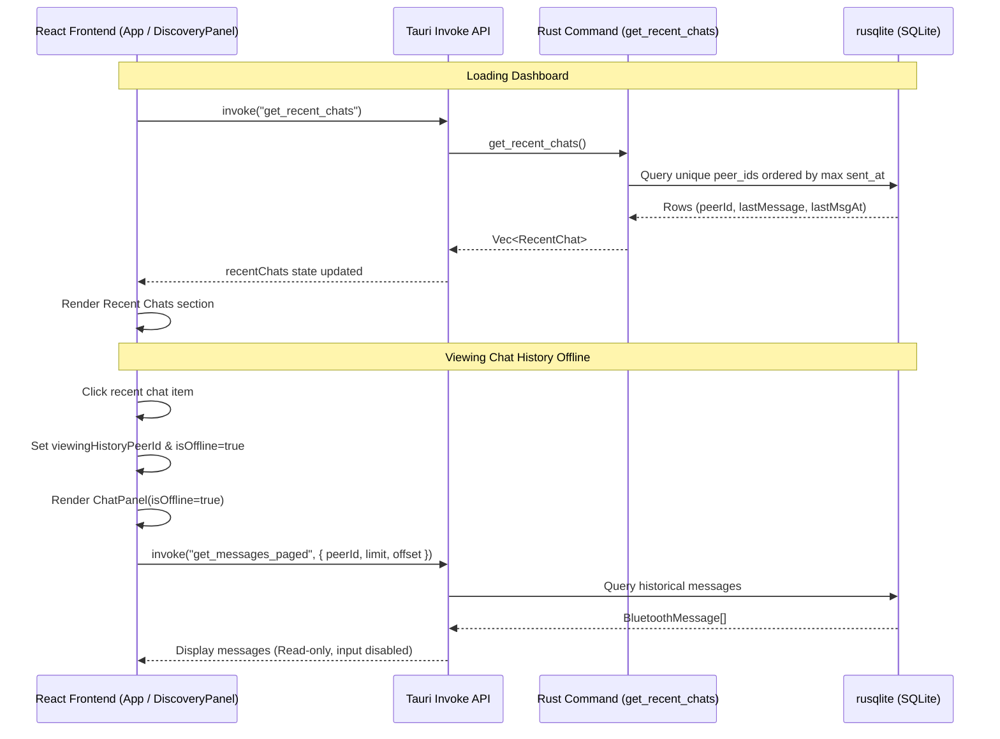

# Implementation Walkthrough: Recent Chats Feature

We have implemented the **Recent Chats** feature allowing you to view previous chats with other devices in offline/read-only mode. This enables you to access chat messages and downloads history without needing to actively connect to the device.

## Architecture Diagram

The following diagram illustrates how the frontend components and Rust command layers interact to fetch recent chats and support offline history viewing:



## Component Changes

### 1. Database & Rust Backend
* **[types.rs](file:///home/dontloseyourheadsu/Documents/GitHub/BinaryStars/tauri/src-tauri/src/core/types.rs)**: Added `RecentChat` struct supporting serialization to camelCase for the frontend.
* **[database.rs](file:///home/dontloseyourheadsu/Documents/GitHub/BinaryStars/tauri/src-tauri/src/core/database.rs)**: Implemented `query_recent_chats` which aggregates message records grouped by `peer_id` and sorted by the latest message's timestamp.
* **[chat.rs](file:///home/dontloseyourheadsu/Documents/GitHub/BinaryStars/tauri/src-tauri/src/features/chat.rs)**: Added the `get_recent_chats` Tauri command.
* **[lib.rs](file:///home/dontloseyourheadsu/Documents/GitHub/BinaryStars/tauri/src-tauri/src/lib.rs)**: Registered the command in the Tauri build handler.

### 2. Frontend Logic & API
* **[chatApi.ts](file:///home/dontloseyourheadsu/Documents/GitHub/BinaryStars/tauri/src/features/chat/chatApi.ts)**: Added `RecentChat` interface and `getRecentChats` invoke function.
* **[App.tsx](file:///home/dontloseyourheadsu/Documents/GitHub/BinaryStars/tauri/src/App.tsx)**: Added state for `recentChats` and `viewingHistoryPeerId`. Triggered a dashboard refresh whenever a user returns to the dashboard. Added routing condition:
  ```tsx
  } else if (viewingHistoryPeerId) {
    <ChatPanel
      isDark={isDark}
      peerId={viewingHistoryPeerId}
      isOffline={true}
      onDisconnect={() => setViewingHistoryPeerId(null)}
    />
  }
  ```

### 3. User Interface & Layout
* **[DiscoveryPanel.tsx](file:///home/dontloseyourheadsu/Documents/GitHub/BinaryStars/tauri/src/features/discovery/DiscoveryPanel.tsx)**: Added a "Recent Chats" section under "Receive Connections". Each item displays:
  * Chat icon `💬`
  * Peer Device ID
  * Relative timestamp of the last message
  * Preview of the last message (with auto-ellipses)
* **[ChatPanel.tsx](file:///home/dontloseyourheadsu/Documents/GitHub/BinaryStars/tauri/src/features/chat/ChatPanel.tsx)**: If `isOffline` is true:
  * Uses a grey indicator next to the peer title to signal offline status.
  * Sets the header label to `Historical Archive`.
  * Changes the disconnection button to `Close History`.
  * Hides the active transmission input tray and replaces it with a premium cosmic-styled status banner: *🪐 Viewing historical chat archive. Connect to device to transmit new signals.*
  * Keeps file download and save actions fully functional.
* **[features.css](file:///home/dontloseyourheadsu/Documents/GitHub/BinaryStars/tauri/src/features/features.css)**: Implemented styling rules for `.recent-item`, `.recent-info`, `.recent-meta`, `.offline-banner`, and `.online-indicator.offline` across both dark and light modes.
